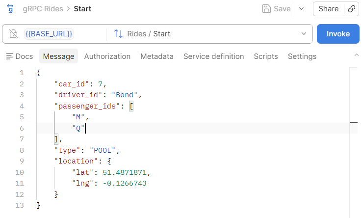
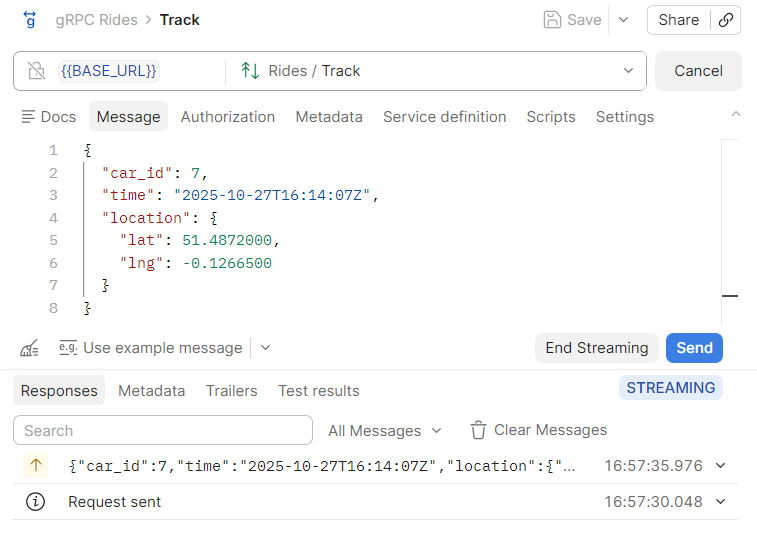

# Car Rides
Example of a gRPC server and client in Python.

## Instructions
1. Generate `rides/rides_pb2.py` and `rides/rides_pb2_grpc.py` from `proto/rides.proto`:
```
python -m grpc_tools.protoc \
    -Iproto \
    --python_out=rides \
    --grpc_python_out=rides \
    proto/rides.proto
```
2. Run the server: `python rides/server.py`
3. In a different terminal, try the different examples that illustrate specific parts of gRPC

    - `python rides/01_marshalling.py`. Marshalling and unmarshalling a request
    - `python rides/02_enumeration.py`. Working with an ENUM type
    - `python rides/03_nested.py`. Nesting definitions
    - `python rides/04_timestamp.py`. Using datetimes
    - `python rides/05_json.py`. Comparison between JSON and Protocol Buffers
4. Run the client in two different ways: 
    a. Client/server: `python rides/client.py`  
        - The car requests a new ride.
        - The server will return a ride ID.
    b. Streaming: `python rides/client.py events`.         
        - The car streams its location to the server, which tracks it.
        - The client will send 7 random events to the server, which will acknowledge them.

## Testing
The folder `postman` includes a Postman environment to test this gRPC API. Since Postman does not allow exporting gRPC collections, the corresponding collection must be created manually with the following requests:
- Start. Requests the Start unary operation
    - Create a gRPC request using `BASE_URL` as request URL and Start as method
    - Import `rides.proto` under "Service definition"
    - Paste the following JSON under "Message":
        ```json
        {
            "car_id": 7,
            "driver_id": "Bond",
            "passenger_ids": [
                "M",
                "Q"
            ],
            "type": "POOL",
            "location": {
                "lat": 51.4871871,
                "lng": -0.1266743
            }
        }
        ```
    
- Track. Requests the Track streaming operation:
    - Create a gRPC request using `BASE_URL` as request URL and Track as method
    - Import `rides.proto` under "Service definition"
    - Invoke the request
    - Send several messages with different values under "Message", e.g.:
        ```json
        {
            "car_id": 7,
            "time": "2025-10-27T16:14:05Z",
            "location": {
                "lat": 51.4871871,
                "lng": -0.1266743
            }
        }
        ```
        ```json
        {
            "car_id": 7,
            "time": "2025-10-27T16:14:07Z",
            "location": {
                "lat": 51.4872000,
                "lng": -0.1266500
            }
        }
        ```
        ```json
        {
            "car_id": 7,
            "time": "2025-10-27T16:14:09Z",
            "location": {
                "lat": 51.4872300,
                "lng": -0.1266000
            }
        }
        ```
    - End the streaming by clicking on "End Streaming". The server will return the number of messages received
    

## Tools
Python

## Author
- Miki Tebeka, from the LinkedIn Learning course [*gRPC in Python*](https://www.linkedin.com/learning/grpc-in-python) (2022)
- Postman collection and environment created by Arturo Mora-Rioja